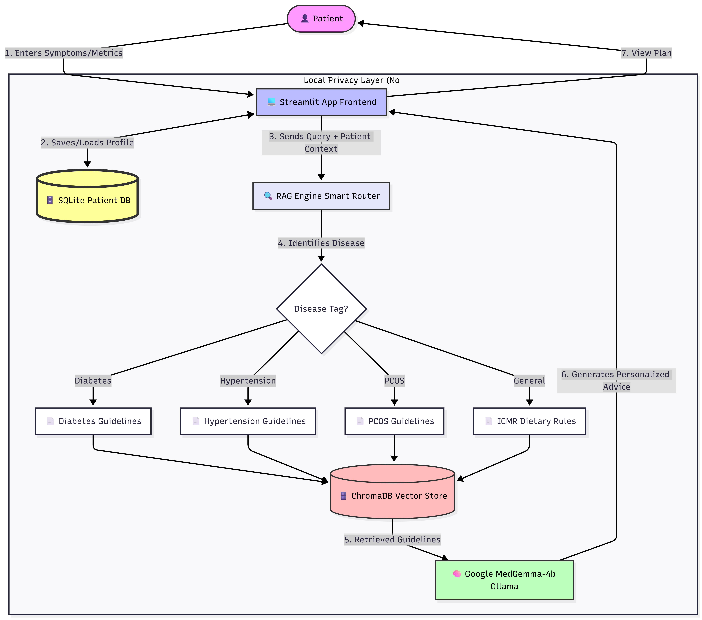

# NutriMED AI: AI-Powered Clinical Nutrition Assistant

<div align="center">



[](https://www.python.org/downloads/)
[](https://streamlit.io/)
[](https://huggingface.co/MedAIBase/MedGemma1.5)
[](LICENSE)

**An intelligent clinical nutritionist AI powered by MedGemma LLM and RAG-based evidence retrieval**

[Features](#features) • [Installation](#installation) • [Quick Start](#quick-start) • [Architecture](#architecture) • [Documentation](#documentation)

</div>

---

## 📋 Overview

**NutriMED AI** is an intelligent clinical nutrition advisory system that combines:
- **Medical Language Model (MedGemma)** for specialized nutrition guidance
- **Retrieval-Augmented Generation (RAG)** for evidence-based clinical guideline retrieval  
- **Patient-Centric Architecture** with personalized diet planning for specific medical conditions
- **Streamlit Web Interface** for seamless user interaction

This application addresses the critical gap in accessible, personalized nutrition counseling by providing evidence-based dietary recommendations tailored to individual patient profiles and clinical markers.

### Problem Statement

Millions worldwide struggle with chronic diseases like Type 2 Diabetes, Hypertension, PCOS, Anemia, and Obesity. While personalized nutrition is proven to improve outcomes, access to clinical nutritionists remains limited and expensive. **NutriMED AI democratizes access** to expert-level nutrition guidance by leveraging advanced AI and clinical knowledge bases.

---

## ✨ Key Features

### 🔐 Patient Management
- Secure patient registration with comprehensive clinical profiles
- Storage of medical conditions, measurements, and health goals
- Multi-condition support: Type 2 Diabetes, Hypertension, Anemia, PCOS, Obesity, General Health

### 🧠 AI-Powered Nutrition Consultation
- **Real-time streaming responses** for interactive conversations
- **Context-aware advice** based on patient medical history and clinical markers
- **Disease-specific guidance** tailored to individual conditions
- **Indian diet focus** with culturally-relevant food recommendations

### 📚 Evidence-Based Retrieval (RAG)
- **Medical guideline integration** supporting ICMR, InSH Consensus, and clinical standards
- **Semantic search** for relevant clinical documents
- **Smart metadata tagging** for disease-category matching
- **Source citation** tracking for transparency and verification

### 📊 Clinical Dashboard
- View personalized clinical profiles
- Monitor health goals and medical markers
- Track AI consultation history

### 🤖 Advanced Model Capabilities
- **MedGemma 1.5 (4B)** - specialized medical language model via Ollama
- **Streaming architecture** for real-time token delivery
- **Fallback mechanisms** ensuring service reliability
- **Production-grade error handling** and logging

---

## 🛠️ Technology Stack

| Component | Technology |
|-----------|-----------|
| **Language Model** | MedGemma 1.5 (via Ollama) |
| **Embeddings** | OllamaEmbeddings (llama3) |
| **Vector Database** | Chroma (ChromaDB) |
| **LangChain Integration** | LangChain 0.0.X |
| **Web Framework** | Streamlit |
| **Database** | SQLite3 |
| **Document Processing** | PyMuPDF (PDF ingestion) |
| **Python Runtime** | 3.9+ |

---

## 📦 Installation

### Prerequisites
- Python 3.9 or higher
- [Ollama](https://ollama.ai/) installed and running
- pip package manager
- 2GB+ available RAM for MedGemma model

### Step 1: Clone the Repository

```bash
git clone https://github.com/ckswainds/MedGemma-Nutrition.git
cd MedGemma-Nutrition
```

### Step 2: Create Virtual Environment

```bash
# On Windows
python -m venv venv
venv\Scripts\activate

# On macOS/Linux
python3 -m venv venv
source venv/bin/activate
```

### Step 3: Install Dependencies

```bash
pip install -r requirements.txt
```

### Step 4: Start Ollama Server

In a new terminal, start the Ollama service:

```bash
ollama serve
```

### Step 5: Pull MedGemma Model

In another terminal:

```bash
ollama pull MedAIBase/MedGemma1.5:4b
```

### Step 6: Configure Environment

Create a `.env` file in the project root:

```bash
python setup_project.py
```

Then edit `.env` with your configuration:

```env
HUGGINGFACE_API_KEY=your_key_here
OLLAMA_MODEL=MedAIBase/MedGemma1.5:4b
OLLAMA_BASE_URL=http://localhost:11434
MODEL_TEMPERATURE=0.4
VECTOR_DB_PATH=data/chroma_db
DATABASE_PATH=data/patients.db
```

---

## 🚀 Quick Start

### Running the Application

```bash
streamlit run app.py
```

The application will be available at `http://localhost:8501`

### Typical Workflow

1. **Register Patient**
   - Enter clinical profile (age, weight, height, activity level)
   - Select primary medical condition
   - Provide disease-specific metrics (e.g., HbA1c for diabetes)
   - Define health goal

2. **Load Clinical Guidelines**
   - Click "📥 Load Guidelines" in sidebar
   - PDFs from `assets/guidelines/` are indexed into vector store
   - One-time setup (guidelines persist in `data/chroma_db/`)

3. **AI Consultation**
   - Log in with registered name
   - Chat with MedGemma AI nutritionist
   - Ask about specific foods, meal plans, or nutrition strategies
   - View cited clinical sources

### Example Queries

```
✅ "Can I eat mangoes with my diabetes?"
✅ "Suggest a breakfast plan for hypertension management"
✅ "What foods help increase hemoglobin naturally?"
✅ "Is curd good for PCOS?"
✅ "Create a 7-day low-sodium diet plan"
```

---

## 🏗️ Project Architecture

### System Architecture

```
┌─────────────────────────────────────────────────────────────┐
│                    STREAMLIT WEB INTERFACE                  │
│  (User Authentication, Chat Interface, Dashboard Display)   │
└──────────────────┬──────────────────────────────────────────┘
                   │
        ┌──────────┴──────────┐
        │                     │
┌───────▼────────┐   ┌───────▼──────────┐
│   DATABASE     │   │  RAG ENGINE      │
│   (SQLite3)    │   │  (Chroma+LLM)    │
│                │   │                  │
│ • Patients     │   │ • Vector Store   │
│ • Profiles     │   │ • PDF Ingestion  │
│ • History      │   │ • Semantic Search│
└────────────────┘   └───────┬──────────┘
                              │
                      ┌───────▼──────────┐
                      │  OLLAMA SERVICE  │
                      │                  │
                      │ • MedGemma 1.5   │
                      │ • Embeddings     │
                      │ • Streaming      │
                      └──────────────────┘
```

### Module Structure

**`modules/database.py`**
- SQLite3 database management
- Patient record CRUD operations
- Clinical context generation
- Disease-specific metric formatting

**`modules/medgemma_model.py`**
- MedGemmaModel class for LLM interaction
- ChatOllama integration via LangChain
- Prompt engineering for nutrition advice
- Streaming and non-streaming generation
- Singleton pattern for model instance management

**`modules/rag_engine.py`**
- RAGEngine class for retrieval system
- PDF document ingestion (PyMuPDFLoader)
- Vector database management (Chroma)
- Semantic similarity search
- Document chunking and metadata tagging
- Fallback guidance for unavailable sources

**`app.py`**
- Streamlit application entrypoint
- Multi-page interface (Registration, Login, Consultation)
- Session state management
- Real-time streaming UI
- Clinical dashboard display

---

## 📋 Supported Medical Conditions

### 1. Type 2 Diabetes
- **Clinical Markers**: HbA1c (%), Medication status
- **Guidance**: Blood sugar control, insulin sensitivity, carbohydrate management

### 2. Hypertension
- **Clinical Markers**: Systolic/Diastolic BP (mmHg)
- **Guidance**: Sodium reduction, potassium intake, DASH diet alignment

### 3. Anemia
- **Clinical Markers**: Hemoglobin level (g/dL), Symptoms
- **Guidance**: Iron-rich foods, vitamin C absorption, dietary patterns

### 4. PCOS (Polycystic Ovary Syndrome)
- **Clinical Markers**: Menstrual cycle status, Weight gain difficulty
- **Guidance**: Hormonal balance, insulin resistance management, anti-inflammatory foods

### 5. Obesity
- **Clinical Markers**: BMI, Target weight
- **Guidance**: Sustainable weight loss, caloric deficit strategies, lifestyle integration

### 6. General Health
- **Guidance**: Balanced nutrition, preventive health strategies

---

## 🔍 How It Works

### Patient Consultation Flow

```
1. Patient Query
   ↓
2. Retrieve Clinical Context
   • Load patient database record
   • Format clinical summary (BMI, markers, condition)
   ↓
3. RAG Retrieval
   • Embed query using OllamaEmbeddings
   • Search vector database for similar guidelines
   • Retrieve top-k relevant documents
   ↓
4. Prompt Construction
   • Combine patient context + guidelines + query
   • Create system prompt with disease-specific instructions
   ↓
5. LLM Processing
   • MedGemma generates response via ChatOllama
   • Stream tokens in real-time to UI
   ↓
6. Response Delivery
   • Stream response to user
   • Display clinical sources used
```

### Document Processing Pipeline

```
PDF Upload
   ↓
PyMuPDFLoader (Extraction)
   ↓
Automatic Category Tagging
(Diabetes, Hypertension, Anemia, PCOS, Obesity, General)
   ↓
RecursiveCharacterTextSplitter
(Chunk: 1000 chars, Overlap: 200 chars)
   ↓
OllamaEmbeddings Generation
   ↓
Chroma Vector Store
(Persistent: data/chroma_db/)
```

---

## 📊 Database Schema

### Patients Table

```sql
CREATE TABLE patients (
    id INTEGER PRIMARY KEY,
    name TEXT UNIQUE NOT NULL,
    age INTEGER,
    gender TEXT,
    weight_kg REAL,
    height_cm REAL,
    activity_level TEXT,
    condition TEXT,
    specific_metrics TEXT,  -- JSON format
    health_goal TEXT,
    created_at TIMESTAMP DEFAULT CURRENT_TIMESTAMP
)
```

### Specific Metrics Format (JSON)

**Diabetes:**
```json
{"hba1c": 7.2, "medication": "Metformin/Tablets"}
```

**Hypertension:**
```json
{"bp_systolic": 145, "bp_diastolic": 92}
```

**Anemia:**
```json
{"hemoglobin": 10.5, "symptoms": ["Fatigue", "Pale Skin"]}
```

**PCOS:**
```json
{"periods": "Irregular", "weight_gain": true}
```

**Obesity:**
```json
{"bmi": 32.5, "target_weight": 70}
```

---

## ⚙️ Configuration

### Environment Variables (.env)

```env
# Model Configuration
OLLAMA_MODEL=MedAIBase/MedGemma1.5:4b
OLLAMA_BASE_URL=http://localhost:11434

# Model Hyperparameters
MODEL_TEMPERATURE=0.4          # Lower = more deterministic
MODEL_TOP_P=0.9
MODEL_TOP_K=50
MODEL_MAX_LENGTH=3000

# Storage Configuration
VECTOR_DB_PATH=data/chroma_db
DATABASE_PATH=data/patients.db

# API Keys (optional)
HUGGINGFACE_API_KEY=your_key_here
LANGSMITH_API_KEY=your_key_here

# Application Settings
DEBUG=False
LOG_LEVEL=INFO
```

### Streamlit Configuration (optional)

Create `~/.streamlit/config.toml`:

```toml
[theme]
primaryColor = "#FF6B6B"
backgroundColor = "#F5F5F5"
secondaryBackgroundColor = "#E8E8E8"
textColor = "#333"

[server]
maxUploadSize = 200
```

---

## 📚 Adding Clinical Guidelines

### Supported PDF Format

Place PDF files in `assets/guidelines/`:

```
assets/guidelines/
├── 01_Type2_Diabetes_Guidelines.pdf
├── 02_Hypertension_Management.pdf
├── 03_Nutrition_Anemia_Care.pdf
├── 04_PCOS_Dietary_Management.pdf
└── 05_Obesity_Prevention_Guidelines.pdf
```

**Process:**
1. Copy PDFs to `assets/guidelines/`
2. Run the app: `streamlit run app.py`
3. Click "📥 Load Guidelines" in sidebar
4. Guidelines indexed automatically with disease tagging

---

## 🧪 Testing

### Manual Testing Checklist

- [ ] Patient Registration (all conditions)
- [ ] Patient Login
- [ ] AI Consultation responses
- [ ] Source citation display
- [ ] Error handling (Ollama offline)
- [ ] Fallback mechanism activation

### Test Patient Profiles

```python
# Diabetes Patient
name="Rajesh Kumar", age=45, weight=85, height=172,
condition="Type 2 Diabetes", hba1c=8.2, medication="Insulin"

# Hypertension Patient
name="Priya Singh", age=52, weight=72, height=160,
condition="Hypertension", bp_systolic=160, bp_diastolic=95

# Anemia Patient
name="Ananya Patel", age=28, weight=62, height=165,
condition="Anaemia", hemoglobin=9.5, symptoms=["Fatigue", "Dizziness"]
```

---

## 🔒 Security & Privacy

- **No external data transmission**: All processing local via Ollama
- **Patient data isolation**: SQLite database stores locally
- **No API call logging**: No PII uploaded to external services
- **GDPR-friendly**: Delete patient records without external cleanup needed

---

## 🚧 Advanced Usage

### Custom Model Configuration

Modify `modules/medgemma_model.py`:

```python
self.temperature = float(os.getenv('MODEL_TEMPERATURE', '0.3'))  # More precise
self.num_predict = 4000  # Longer responses
```

### Extending Medical Conditions

Edit `app.py` registration form:

```python
st.session_state['selected_condition'] = st.selectbox(
    "Primary Medical Condition", 
    ["General Health", "Type 2 Diabetes", "Hypertension", 
     "Anaemia", "PCOS", "Obesity", "YOUR_NEW_CONDITION"],
)
```

### Custom Prompt Engineering

Modify system prompt in `modules/medgemma_model.py` `_create_nutrition_prompt()` method for different response styles.

---

## 📈 Performance Metrics

- **Response Time**: ~2-5 seconds (with Ollama running)
- **Streaming Latency**: First token in ~500ms
- **Vector Search**: ~100-200ms for top-4 retrieval
- **Model Memory**: ~2.5GB (MedGemma 1.5:4b)

---

## ❓ Troubleshooting

### Issue: "Model not ready" warning

**Solution:**
```bash
# Ensure Ollama is running
ollama serve

# In another terminal, verify model is loaded
ollama list
```

### Issue: Vector store not found

**Solution:**
```bash
# Delete and regenerate vector store
rm -rf data/chroma_db/
streamlit run app.py
# Click "Load Guidelines" button
```

### Issue: PDF not loading

**Solution:**
- Place PDFs in `assets/guidelines/`
- Ensure PDF files are readable (not corrupted)
- Check logs for specific errors

### Issue: Slow responses

**Solution:**
- Reduce `MODEL_MAX_LENGTH` in `.env`
- Reduce `k` parameter in `retrieve_context()` (lines 190+)
- Enable GPU acceleration if available

---

## 🤝 Contributing

Contributions are welcome! Areas for enhancement:

- [ ] Multi-language support
- [ ] Mobile app version
- [ ] Integration with wearable health devices
- [ ] Multi-patient batch processing
- [ ] Advanced analytics dashboard
- [ ] Video consultation support
- [ ] Integration with EHR systems

---

## 📝 License

This project is licensed under the MIT License - see [LICENSE](LICENSE) file for details.

---

## 🙏 Acknowledgments

- **MedGemma Team** - Medical language model
- **LangChain** - RAG & LLM orchestration
- **Chroma** - Vector database
- **Streamlit** - Web framework
- **Clinical Guidelines** - ICMR, InSH, medical organizations

---

## 📞 Support & Contact

For issues, questions, or suggestions:
- 🐛 [GitHub Issues](https://github.com/ckswainds/MedGemma-Nutrition/issues)
- 💬 Open a discussion thread

---

## ⚖️ Medical Disclaimer

**This application is for educational and informational purposes only.** It should not be used as a substitute for professional medical advice, diagnosis, or treatment. Always consult with qualified healthcare professionals for medical decisions.

---

<div align="center">

**Built with ❤️ for improved global nutrition healthcare access**

[⬆ Back to top](#nutrimed-ai-ai-powered-clinical-nutrition-assistant)

</div>